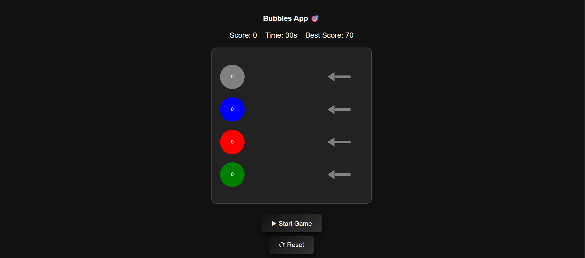
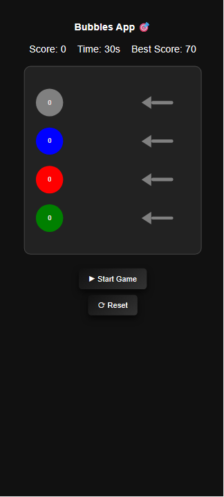

# Bubbles App 🎯

A fun interactive game where users click colored circles to score points. The game has a timer, tracks the score, shows arrows when circles are clicked, and keeps track of the best score.

---

## Features

- Click on colored circles to score points.
- Animated arrows indicate interaction.
- Game timer: 15 seconds per round.
- Best score tracking with localStorage.
- Responsive design for mobile and desktop.
- Dark theme for eye-friendly gameplay.
- Reset and stop functionality.

---

## How to Play

1. Click the **Start Game** button.
2. A popup will appear with instructions — click **Start** to begin.
3. Click on the circles as fast as possible before time runs out.
4. Try to beat your **Best Score**!

---

## Short Sections

### 1. Tech Stack

- **Frontend:** HTML, CSS, JavaScript  
- **Animations:** CSS transitions  
- **Storage:** localStorage for best score  

### 2. Gameplay Flow

- User clicks **Start Game** → popup appears → click popup button → game starts.  
- Each circle click triggers an arrow animation and increases score.  
- Game lasts 15 seconds, then shows final score and allows replay.

---

## 🖼️ Screenshot

> Add a screenshot in the repository at `screenshot/moodly.png` to display below.

  ---

---

## Author

Manish Kumar  
[GitHub](https://github.com/Manishkumar82077)
